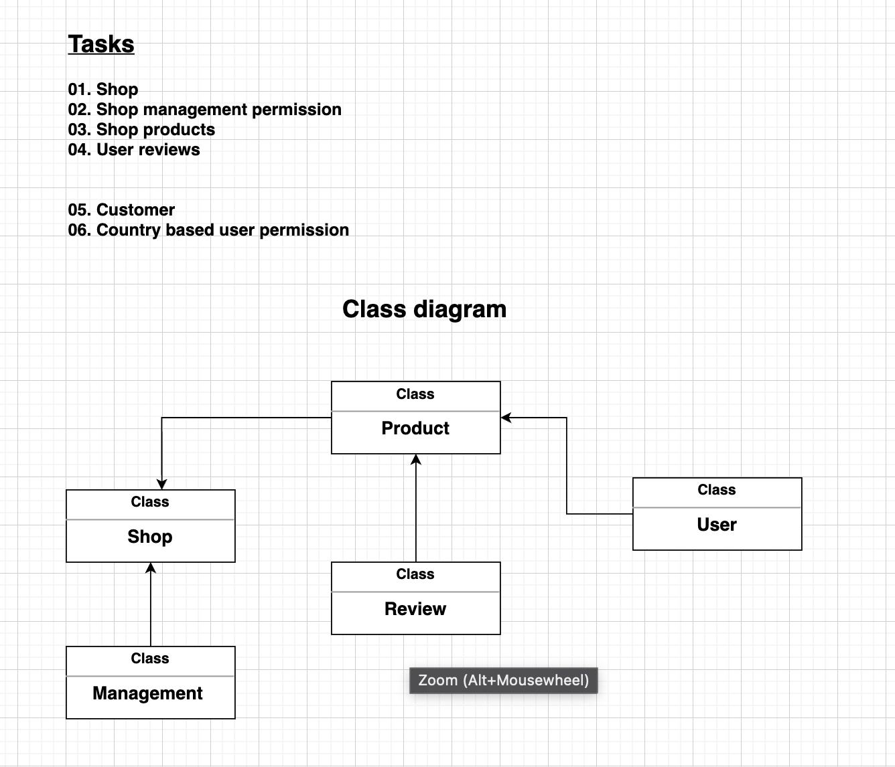

# eCom idea

## Tasks
```
    1. Shop
    2. Shop management permission
    3. Shop products
    4. Reviews
    5. User
    6. Country based user permission
```
### Class diagram

<ol>
    <li>User</li>
  <li>
    Shop
    <ol>
        <li>Management</li>
        <li>Products</li>
        <li>Reviews</li>
    </ol>
  </li>
  <li>
    Country based laws
    <ol>
      <li>China</li>
      <li>Bangladesh</li>
      <li>Pakistan</li>
      <li>United State</li>
    </ol>
  </li>
</ol>

### Used technoloy
<ol>
    <li>
        Technologys
        <ol>
            <li>JavaScript</li>
            <li>TypeScript</li>
            <li>NodeJs</li>
            <li>ExpressJs</li>
            <li>ReactJs</li>
            <li>NextJs</li>
            <li>Jest</li>
            <li>Eslint</li>
        </ol>
    </li>
    <li>
        Database
        <ol>
            <li>Redis</li>
            <li>MongoDB</li>
        </ol>
    </li>
    <li>
        Others
        <ol>
            <li>Docker</li>
            <li>Kubernetes</li>
            <li>Nginx</li>
            <li>GitHub</li>
            <li>CI/CD</li>
            <li>Skaffold</li>
            <li>Postman</li>
        </ol>
    </li>
</ol>